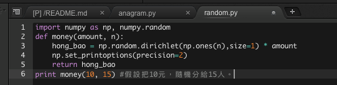

Posted in Feb and by April 14, 193 views and 6 likes (Originally posted on Linkedin Pulse)

感謝各位在過年期間的慷慨解囊，收了不少大家在微信裡發的紅包。覺得這個搶紅包的功能為這個新年增加了不少樂趣。這幾天微信跟的一個 Python 群，跟著流行所以也發了一則微信紅包演算法的討論。只是很囧的範例竟然是用 C 寫的......。所以自己試著用 Python 寫一個簡單的方法，把預算的金額以隨機的方式發給想定的人數（見下圖）。

Wiki 裡對微信紅包的介紹：
“Red envelope lucky draw
The user assigns a lump sum to a group red envelope, and the number of small red envelopes within it. 
After posting to a group chat, WeChat will randomly assign the amount in each envelope to each recipient[3]”

參考資料：

- The Digital Red Envelope – the new way to deliver your cash online
- numpy.random.dirichlet
- https://zh.wikipedia.org/wiki/狄利克雷分布

tag: fintech, chinese culture, algorithm
